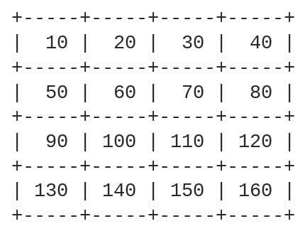
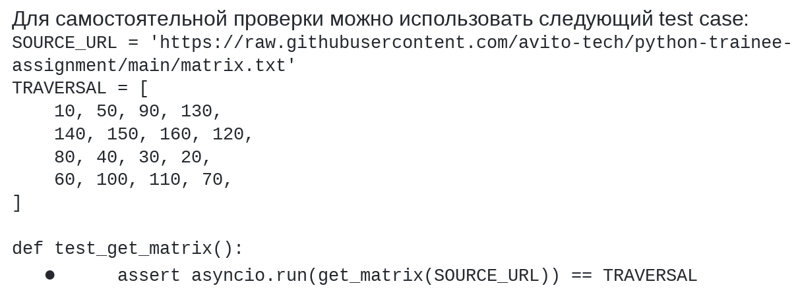

# Кейс «Разработка алгоритма обхода матрицы по спирали, полученной по сети» 

## Условие

Необходимо реализовать Python-библиотеку, которая осуществляет получение квадратной матрицы (NxN) 
с удалённого сервера и возвращает её пользователю в виде List[int]. Этот список должен 
содержать результат обхода полученной матрицы по спирали: против часовой стрелки, начиная с 
левого верхнего угла

Пример исходной матрицы:

Матрица гарантированно содержит целые неотрицательные числа. Форматирование границ иными 
символами не предполагается.

## Требования к выполнению и оформлению

Библиотека содержит функцию со следующим интерфейсом:
async def get_matrix(url: str) -> List[int]:

- Функция единственным аргументом получает URL для загрузки матрицы с сервера по протоколу HTTP(S)
- Функция возвращает список, содержащий результат обхода полученной матрицы по спирали: против часовой стрелки, начиная с левого верхнего угла
- Взаимодействие с сервером должно быть реализовано асинхронно - посредством aiohttp, httpx или другого компонента на asyncio
- Библиотека должна корректно обрабатывать ошибки сервера и сетевые ошибки (5xx, Connection Timeout, Connection Refused, …)
- В дальнейшем размерность матрицы может быть изменена с сохранением форматирования. 
  Библиотека должна сохранить свою работоспособность на квадратных матрицах другой размерности

## Проверка решения

При проверке мы также будем обращать внимание на тесты, type hints, структуру решения и общее качество кода.

